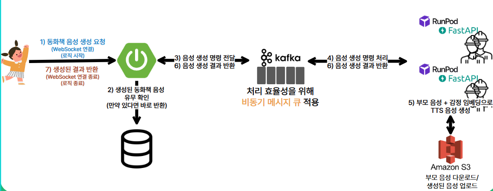

# 🙂 기여한 부분

## 담당 역할

1. TTS 모델 조사 및 적용
2. 부모 목소리 기반 동화 음성 생성 개발
3. 캐릭터와 편지 주고 받기 기능 개발
4. 시스템 간 통신 방식 설계 및 구현

## 🚀 트러블 슈팅

### 1. 시스템 간 통신 방식

#### 문제 상황

- AI 기능의 경우, 타 기능에 비해 많은 시간과 서버 리소스가 소모됨
- AI 로직이 완료될때까지 메인 서버(Spring boot)가 대기하는 경우 많은 쓰레드 낭비가 발생
- 동기 방식(ex: API 호출)으로 시스템 구성 시 서버에 많은 리소스가 낭비되어 많은 서버 가용성에 많은 악영향이 발생

#### 해결 방안 : `비동기 메시지 큐(kafka) 기반의 비동기 처리 적용`

## 

- 메인 서버(스프링 부트)가 비동기 메시지 큐인 kafka에 명령을 Produce / 생성 결과를 Consume
- Fast API 서버가 kafka에 작성된 명령을 하나씩 Consume한 후, AI 로직 수행
- AI 로직 처리 후, 생성된 결과를 Kafka에 Produce
- 사용자가 Polling 방식으로 결과를 조회 시 불필요한 트래픽이 발생할 것이라고 생각하여 WebSocket으로 결과 반환

#### 추후 개선방안

- 웹소캣 연결이 늘어날 경우, 서버 쓰레드가 낭비되므로 `Webflux`방식으로 리팩토링하면 좋을 거 같다.
- 유저와 서버 사이에는 단방향 통신만 필요하니 `SSE(Server-Sent Events)`로 구현하는게 더 적합한 선택 방식이었을 거 같다.

---

### 2. 순차적인 AI 로직, 비효율적인 표준 응답 시간

#### 문제 상황1

- 동화 음성 생성 로직이 선형적으로 실행되어 처리 시간이 굉장히 비효율적으로 나왔다.
  - 10개의 요청에 대해 평균 처리 시간 `19분`
- 단일 프로세스에서 모든 작업을 처리하니 CPU 사용률 분산이 안 되고, 전체 처리 속도가 느림

#### 해결 방안1 : `멀티 프로세스 방식 적용`

- python의 `multiprocessing 모듈`을 사용해서 작업 단위를 개별 프로세스로 분기
- 각 프로세스는 독립적으로 음성 생성 작업을 수행해 CPU 코어를 병렬로 활용할 수 있도록 개선

#### 문제 상황2

- 서브 프로세스를 실행할때마다 `모델을 반복적으로 로딩하는 문제` 발생
  - 프로세스 간 메모리를 공유하지 않기 때문에 이러한 문제가 발생함
- 오히려 적용하기보다 응답 시간이 늘어나게 됨

#### 해결 방안2 : `워커-큐 패턴을 적용해서 모델 warm 상태 유지`

- AI 기능 실행 시 서브 프로세스를 실행하는게 아닌, 서버 실행 시에 서브 프로세스를 함께 실행
- 실행된 서브 프로세스는 1회만 모델을 로딩 후 작업을 대기하는 워커 역할을 수행
  - 메인 프로세스 : AI 기능 실행 시, 작업 큐에 작업을 삽입
  - 서브 프로세스 : 큐에서 작업을 꺼내서 AI 기능 실행

#### 결과

<aside>

- `멀티 프로세스 적용 전` : 1144.542초 (약 19분)
- `멀티 프로세스 적용 후`: 511.140초 (약 8분 31초)
- 평균 증가율: 121.5%
</aside>

| bookId | duration_seconds(적용 전) | duration_seconds(적용 후) | difference (v1 - v2) | percent increase (%) |
| ------ | ------------------------- | ------------------------- | -------------------- | -------------------- |
| 1      | 245.590                   | 168.534                   | 77.056               | 45.7%                |
| 2      | 348.068                   | 124.888                   | 223.180              | 178.7%               |
| 3      | 494.464                   | 290.768                   | 203.696              | 70.1%                |
| 4      | 717.020                   | 328.006                   | 389.014              | 118.6%               |
| 5      | 1017.104                  | 438.302                   | 578.802              | 132.1%               |
| 6      | 1114.752                  | 451.500                   | 663.252              | 146.9%               |
| 10     | 1339.388                  | 564.120                   | 775.268              | 137.4%               |
| 11     | 1419.730                  | 574.969                   | 844.761              | 146.9%               |
| 13     | 1558.277                  | 752.169                   | 806.108              | 107.2%               |
| 14     | 1660.038                  | 717.157                   | 942.881              | 131.5%               |
| 17     | 1779.152                  | 856.314                   | 922.838              | 107.8%               |
| 20     | 2040.918                  | 868.975                   | 1171.943             | 134.9%               |

---

### 3. 생성된 음성 퀄리티

#### 상황

- 아이들이 동화책에 몰입하기 위해서는 높은 퀄리티의 음성이 필요
  - 부모와의 음성 유사도
  - 인터렉티브 음성(음높이, 감정, 속도)
  - 음성 생성 시간
- 2가지의 모델 구성 방식을 고민
  1. 생성된 음성 + VC(Voice Conversion) 모델 : 이미 생성된 음성에 부모 음성을 덧씌운다.
     - 장점 | 비교적 준수한 퀄리티
     - 단점 | 너무 긴 모델 학습 시간(최소 1시간), 모델 저장 비용(1개 모델당 2GB)
     - 사용 모델 | RVC(Retrieval-based Voice Conversion)
  2. 텍스트 + 제로샷 TTS 모델 : 부모 음성 임베딩 정보로 텍스트를 읽는 TTS 모델을 사용한다.
     - 장점 | 비교적 빠른 추론 시간
     - 단점 | 다소 떨어질 수 있는 퀄리티
     - 사용 모델 | xtts v2 , LLasa-1B, styleTTS, Zonos TTS
- 다음 아래 같은 기준으로 최종적으로 2번 방식 중 Zonos TTS 모델 활용
  - 다국어 지원 모델
  - 제로샷 | 추가적인 파인 튜닝 없이 30초 음성 데이터로 보이스 클로닝 가능
  - 감정 임베딩 제공

---

# 🌳 동화숲 (FairyTale Forest)

<p align="center">
    
</p>

**"부모의 목소리로 아이의 정서를 살피는 AI 동화 서비스"**

[🔗 서비스 바로가기](https://donghwasoop.com/) · [📘 API 명세서](https://yielding-libra-062.notion.site/API-1d560a1ef67281359594cce20eabaef7?pvs=4) · [🎨 와이어프레임](https://www.figma.com/design/qlkrP2L61tqSOUJ1oiykbp/Wireframe?node-id=29-7&p=f&t=g2o8jc2yXlMdzHI7-0)

---

## 🧸 프로젝트 개요

#### 프로젝트 이름: 동화숲

#### 진행 기간: 2025.04.14 ~ 2025.05.22(6주주)

#### 서비스 소개:

동화숲은 부모의 목소리를 학습한 AI가 아이에게 동화를 읽어주는 감정 기반 TTS 서비스입니다.  
정서적 교감이 필요한 어린이에게 부모의 음성과 감정이 담긴 동화, 동요, 인터랙션 기능을 통해 몰입감 있는 독서 경험을 제공합니다.

---

## ✨ 주요 기능 및 서비스 화면([GIF 보러가기](https://yielding-libra-062.notion.site/gif-20060a1ef672804799c9d8973cecd126?pvs=74))

#### 1. 사용자 계정 관리

- 카카오 소셜 로그인
- 부모 음성 등록 및 관리
- 자녀 프로필 등록 및 관리

<p align="center">
    
</p>

#### 2. AI 음성 동화 서비스 및 동요 서비스

- **부모 목소리 복제**: Zonos 기반 TTS 모델로 자연스러운 음성 생성, 기본 곰돌이 tts로 캐릭터 목소리로 음성 생성 가능
- **감정 표현**: 문장별 감정 분석을 통한 감정 표현 음성 합성
- **동화/동요 콘텐츠**: 대표 동화, 동요 12개 제공
- **동화 생성 뱃지**: 웹 소켓으로 동화 '생성 중', '생성 완료' 뱃지 구분

<p align="center">
    홈 화면 
    
    동화 리스트 화면
    
    동화 상세 화면
    
    동요 상세 화면
    
    
</p>

#### 3. AI 캐릭터 편지

- 동화 속 캐릭터와 음성 편지 교환
- AI가 캐릭터의 특성을 반영한 답장 생성
- 감정 분석 기반의 맞춤형 응답

<p align="center">
    편지 보내기
    
    
    편지함 확인(보낸 편지, 받은 편지 확인 가능)
    
    

</p>

#### 4. 맞춤형 환경 설정

- 배경 음악 On/Off
- 자녀별 설정 프로필 관리

<p align="center">
    아이의 접근을 막기 위한 곱셈 문제
    
    목소리와 자녀 추가 등록
    
    
</p>

---

### AI 기술 상세

- **KoBERT**: 감정 분석 (기쁨, 슬픔, 분노, 놀람, 공포, 혐오, 중립)
- **Zonos TTS**: 감정 표현 가능한 TTS, 10초 학습 샘플만으로 고품질 음성 생성
- **Kafka 비동기 처리**: Spring → Kafka → FastAPI → S3 → Spring 반환 구조

---

## 🧠 AI 음성 생성 파이프라인

```
graph TD
A[사용자 요청] --> B(Spring Boot)
B --> C{음성 존재 여부 확인}
C --있음--> D[바로 반환]
C --없음--> E[Kafka 메시지 전송]
E --> F[FastAPI - Worker 수신]
F --> G[부모 음성 다운로드 + 감정 분석]
G --> H[TTS 모델 음성 생성]
H --> I[DB 저장 + S3 업로드]
I --> J[Spring 알림]
J --> K[WebSocket 응답 전송]|
```

## 🧪 감정 분석 학습 결과 (KoBERT)

데이터: AI Hub + KEMDy19 (총 94,000 문장)

분류 감정: 총 7가지 (기쁨, 슬픔, 분노, 놀람, 공포, 혐오, 중립)

성능: Validation Loss 0.59 (Overfitting 없음)

## 🔍 기술 스택 및 구조

| 구성      | 기술                                                  |
| --------- | ----------------------------------------------------- |
| Frontend  | React, TypeScript, Tailwind CSS, Zustand, React-Query |
| Backend   | Spring Boot, JPA, Redis, MySQL                        |
| AI Server | FastAPI, PyTorch, KoBERT, Zonos                       |
| Infra     | Docker, Kafka, GitLab CI/CD, ELK, AWS S3              |
| 기타      | WebSocket (실시간 알림), Jenkins, K6 (부하 테스트)    |

## 📄 문서 및 참고 링크

- [API 명세서](https://yielding-libra-062.notion.site/API-1d560a1ef67281359594cce20eabaef7?pvs=4)

- [ERD](https://www.erdcloud.com/d/Ha4eRAJs2EWmBWkXD)

- [와이어프레임](https://www.figma.com/design/qlkrP2L61tqSOUJ1oiykbp/Wireframe?node-id=29-7&p=f&t=g2o8jc2yXlMdzHI7-0)

- [서비스 주소](https://donghwasoop.com/)

## 🧑‍💻 팀원 소개

|     역할     | 이름                              |
| :----------: | :-------------------------------- |
| **Frontend** | 오승열 · 정효원 · 최현정          |
| **Backend**  | 김의중 · 김성민 · 백기찬 · 편민준 |
|    **AI**    | 김성민 · 백기찬                   |

## 📦 프로젝트 설치 및 실행

### ✅ Spring Boot 서버

```
cd server
./gradlew build
java -jar build/libs/app.jar
```

### ✅ AI 서버 (FastAPI)

```
cd ai-server
conda activate tts-env
python main.py
```

### ✅ 프론트엔드

```
cd client
npm install
npm run dev
```
