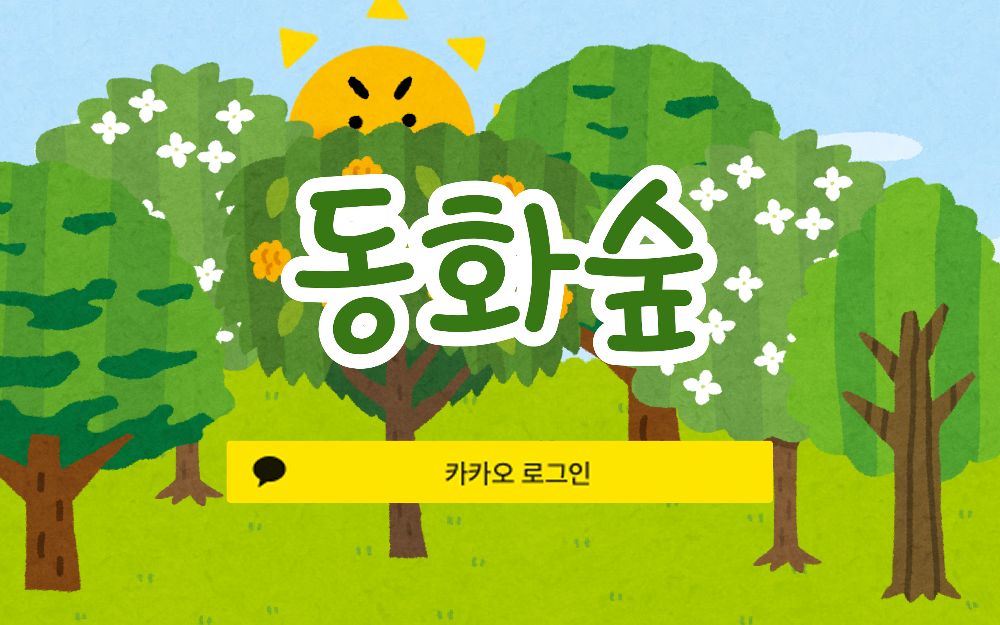
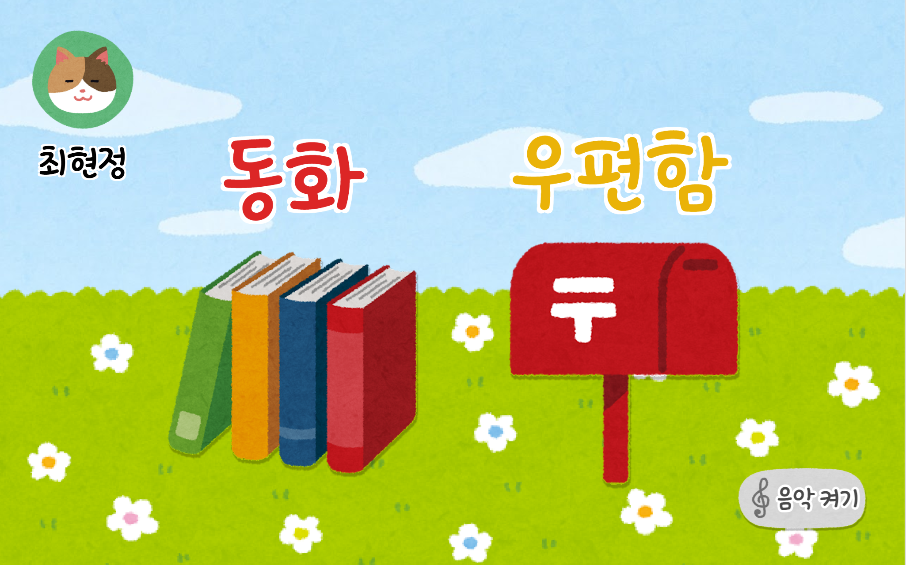
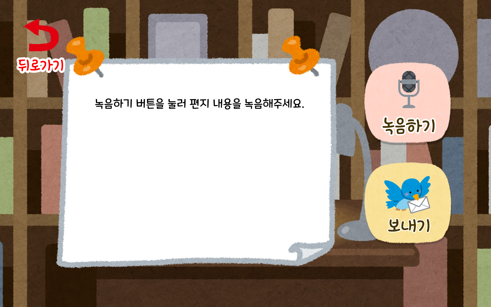
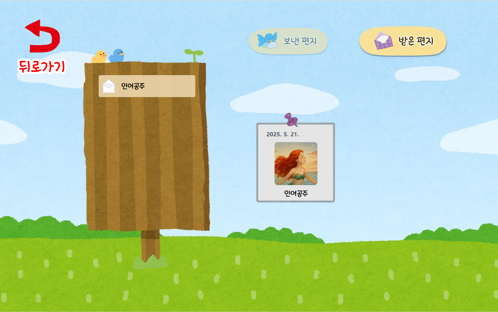
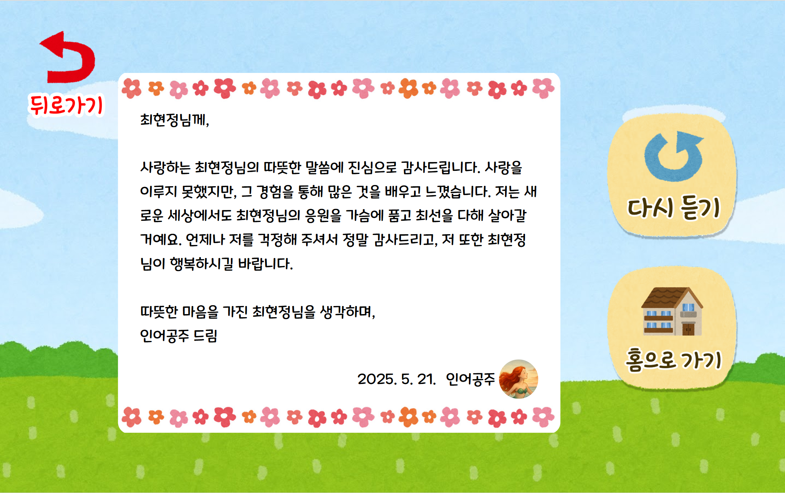
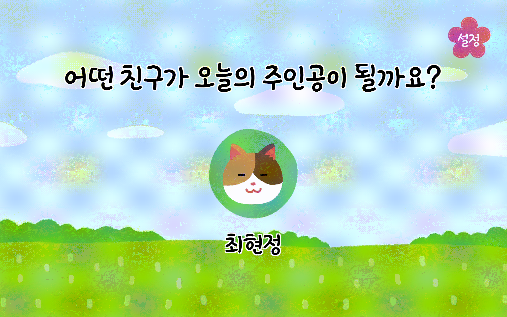
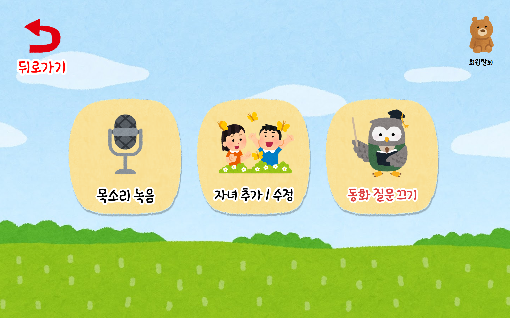

# 🌳 동화숲 (FairyTale Forest)

<p align="center">
    
</p>

**"부모의 목소리로 아이의 정서를 살피는 AI 동화 서비스"**

[🔗 서비스 바로가기](https://donghwasoop.com/) · [📘 API 명세서](https://yielding-libra-062.notion.site/API-1d560a1ef67281359594cce20eabaef7?pvs=4) · [🎨 와이어프레임](https://www.figma.com/design/qlkrP2L61tqSOUJ1oiykbp/Wireframe?node-id=29-7&p=f&t=g2o8jc2yXlMdzHI7-0)

---

## 🧸 프로젝트 개요

#### 프로젝트 이름: 동화숲

#### 진행 기간: 2025.04.14 ~ 2025.05.22

#### 서비스 소개:

동화숲은 부모의 목소리를 학습한 AI가 아이에게 동화를 읽어주는 감정 기반 TTS 서비스입니다.  
정서적 교감이 필요한 어린이에게 부모의 음성과 감정이 담긴 동화, 동요, 인터랙션 기능을 통해 몰입감 있는 독서 경험을 제공합니다.

---

## ✨ 주요 기능 및 서비스 화면([GIF 보러가기](https://yielding-libra-062.notion.site/gif-20060a1ef672804799c9d8973cecd126?pvs=74))

#### 1. 사용자 계정 관리
- 카카오 소셜 로그인
- 부모 음성 등록 및 관리
- 자녀 프로필 등록 및 관리

<p align="center">
    
</p>

#### 2. AI 음성 동화 서비스 및 동요 서비스
- **부모 목소리 복제**: Zonos 기반 TTS 모델로 자연스러운 음성 생성, 기본 곰돌이 tts로 캐릭터 목소리로 음성 생성 가능
- **감정 표현**: 문장별 감정 분석을 통한 감정 표현 음성 합성
- **동화/동요 콘텐츠**: 대표 동화, 동요 12개 제공
- **동화 생성 뱃지**: 웹 소켓으로 동화 '생성 중', '생성 완료' 뱃지 구분

<p align="center">
    홈 화면 
    
    동화 리스트 화면
    
    동화 상세 화면
    
    동요 상세 화면
    
    
</p>

#### 3. AI 캐릭터 편지
- 동화 속 캐릭터와 음성 편지 교환
- AI가 캐릭터의 특성을 반영한 답장 생성
- 감정 분석 기반의 맞춤형 응답

<p align="center">
    편지 보내기
    
    
    편지함 확인(보낸 편지, 받은 편지 확인 가능)
    
    

</p>

#### 4. 맞춤형 환경 설정
- 배경 음악 On/Off
- 자녀별 설정 프로필 관리

<p align="center">
    아이의 접근을 막기 위한 곱셈 문제
    
    목소리와 자녀 추가 등록
    
    
</p>

---

### AI 기술 상세
- **KoBERT**: 감정 분석 (기쁨, 슬픔, 분노, 놀람, 공포, 혐오, 중립)
- **Zonos TTS**: 감정 표현 가능한 TTS, 10초 학습 샘플만으로 고품질 음성 생성
- **Kafka 비동기 처리**: Spring → Kafka → FastAPI → S3 → Spring 반환 구조

---

## 🧠 AI 음성 생성 파이프라인

```
graph TD
A[사용자 요청] --> B(Spring Boot)
B --> C{음성 존재 여부 확인}
C --있음--> D[바로 반환]
C --없음--> E[Kafka 메시지 전송]
E --> F[FastAPI - Worker 수신]
F --> G[부모 음성 다운로드 + 감정 분석]
G --> H[TTS 모델 음성 생성]
H --> I[DB 저장 + S3 업로드]
I --> J[Spring 알림]
J --> K[WebSocket 응답 전송]|
```
## 🧪 감정 분석 학습 결과 (KoBERT)
데이터: AI Hub + KEMDy19 (총 94,000 문장)

분류 감정: 총 7가지 (기쁨, 슬픔, 분노, 놀람, 공포, 혐오, 중립)

성능: Validation Loss 0.59 (Overfitting 없음)

## 🔍 기술 스택 및 구조

| 구성 | 기술 |
|------|------|
| Frontend | React, TypeScript, Tailwind CSS, Zustand, React-Query |
| Backend | Spring Boot, JPA, Redis, MySQL |
| AI Server | FastAPI, PyTorch, KoBERT, Zonos |
| Infra | Docker, Kafka, GitLab CI/CD, ELK, AWS S3 |
| 기타 | WebSocket (실시간 알림), Jenkins, K6 (부하 테스트) |

## 📄 문서 및 참고 링크
*   [API 명세서](https://yielding-libra-062.notion.site/API-1d560a1ef67281359594cce20eabaef7?pvs=4)

*   [ERD](https://www.erdcloud.com/d/Ha4eRAJs2EWmBWkXD)

*   [와이어프레임](https://www.figma.com/design/qlkrP2L61tqSOUJ1oiykbp/Wireframe?node-id=29-7&p=f&t=g2o8jc2yXlMdzHI7-0)

*   [서비스 주소](https://donghwasoop.com/)

## 🧑‍💻 팀원 소개
| 역할 | 이름 |
|:---:|:---|
| **Frontend** | 오승열 · 정효원 · 최현정 |
| **Backend** | 김의중 · 김성민 · 백기찬 · 편민준 |
| **AI** | 김성민 · 백기찬 |

## 📦 프로젝트 설치 및 실행
### ✅ Spring Boot 서버
```
cd server
./gradlew build
java -jar build/libs/app.jar
```
### ✅ AI 서버 (FastAPI)
```
cd ai-server
conda activate tts-env
python main.py
```
### ✅ 프론트엔드
```
cd client
npm install
npm run dev
```

    

    

    
